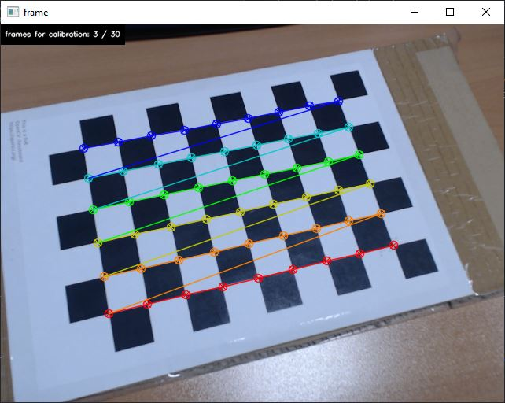
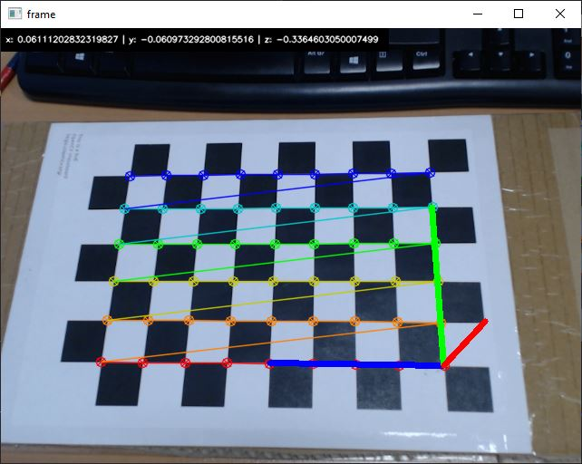

# Блок6. Калибровка камеры

Все материалы для Блока6 представлены в директории /opt/app/Block6/ \
Запуск скриптов производится в докер-контейнере

## Запуск Докера

1. Откройте терминал и перейдите в директорию Courses.
2. Запустите докер контейнер с помощью скрипта:
   ```
   /Courses$ ./run_docker.sh
   ```

## Задание

1. Откалибровать камеру с помощью скриптов, представленных в /opt/app/Block6/
2. Проверить качество калибровки камеры с помощью скрипта для определения расстояний.

## Калибровка камеры

1. Подключите веб-камеру к компьютеру
2. Подготовьте шахматную доску для калибровки
3. Запустите скрипт калибровки calibration.py

   - source - Источник камеры, путь к видео или изображениям.
   - save_path - Путь сохранения результатов калибровки
   - save_images - Путь сохранения изображений для калибровки

   Пример зауска скрипта:

   ```
   python .\calibration.py --source 0 --save_path .\out\ --save_images .\out\
   ```

4. После запуска скрипта отроется окно с видеопотоком. Наведите веб-камеру на калибровочную доску. \
   

5. Чтобы сохранить информацию кадра для калибровки нажмите Enter.

6. После сбора необходимого кол-ва данных нажмите Esc или Q. Закроется окно вывода видеопотока и начнется расчет калибровочной информации.

   Пример вывода скрипта калибровки:

   ```
   --------------------
   Camera Matrix:  [[634.087417    0.        319.5      ]
    [  0.        634.1371097 239.5      ]
    [  0.          0.          1.       ]]
   Distortion Coefficients :  [[ 0.0924081  -0.2268371   0.00279418 -0.0062272   0.19846624]]
   Total error:  0.037336768975212944
   --------------------
   ```

Данные калибровки будут сохранены в формате json будут в save_path.
Чем меньше Total error, тем лучше калибровка.

## Оценка расстояния до камеры

Наглядно оценить качество калибровки можно, использовав калибровочную информацию для расчета расстояний от объекта до камеры.

1. Запустите скрипт get_camera_world_pos.py

   - source - Источник камеры
   - calibration - путь к полученным данным калибровки

   Пример запуска скрипта:

   ```
   python .\get_camera_world_pos.py --source 0 --calibration .\out\calibration__19-05-2025_12-45-01.json
   ```

2. После запуска скрипта отроется окно с видеопотоком. Наведите веб-камеру на калибровочную доску. \
   

3. В окне видеопотока сверху выводится расстояние по 3м осям от камеры до начала координат доски.
4. Измерьте расстояние вручную. Отличается ли оно от полученных данных?

Для выхода из скрипта на клавишу 'Esc' или 'Q'.
